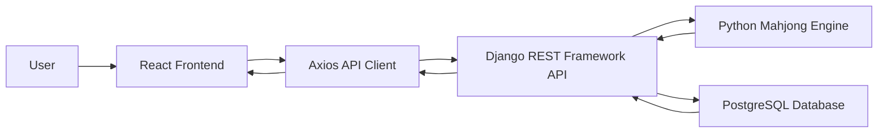
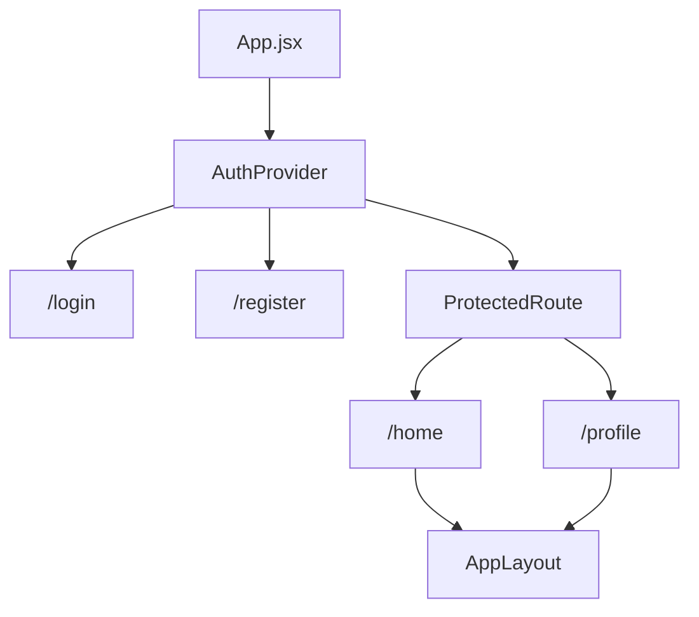
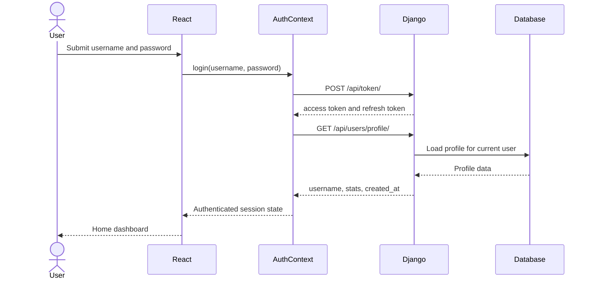
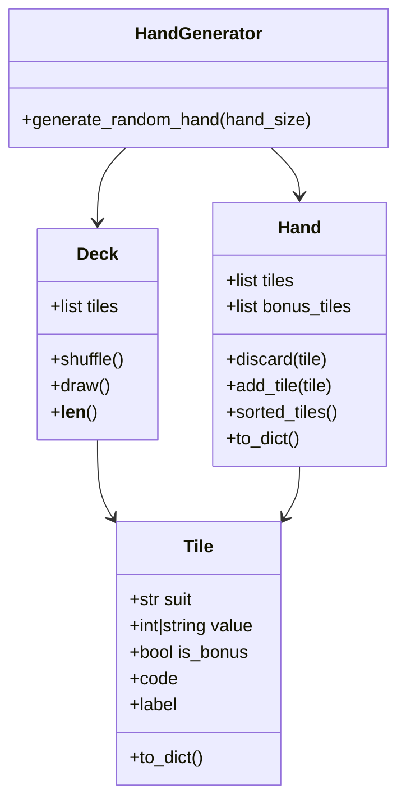
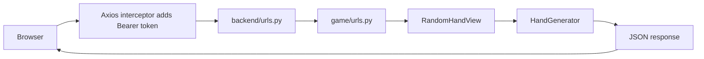

# MahjongSensei

The Orbital 2026 repository for **MahjongSensei**, an interactive Mahjong learning and training web application.

Target level of achievement: **Apollo**

## Motivation

Mahjong has a notoriously steep learning curve. Beginners often struggle with tile recognition, hand structure, scoring, and deciding what to discard. Many learners also do not have easy access to experienced players or friends who can give feedback after each move.

MahjongSensei aims to make Singaporean Mahjong more accessible by combining guided lessons, hand analysis, interactive practice, and eventually solo play against computer-controlled opponents. The long-term goal is to help users move from basic rule understanding to stronger decision-making, and ultimately act as a smart tracking tool in the game of Mahjong.

## User Stories

1. As a beginner, I want to learn Mahjong rules and hand structure through clear lessons, so that I can start playing without relying on another player to teach me.
2. As a learner, I want to see examples of valid hands and scoring patterns, so that I can understand how winning hands are formed.
3. As an intermediate player, I want to input a hand and receive a recommended discard, so that I can compare my own judgement with the system's analysis.
4. As a practice-focused player, I want generated training hands and immediate feedback, so that I can improve my discard decisions.
5. As a returning user, I want my progress and game history tracked, so that I can identify habits in my play style.

## Core Features

1. **Rules and Points Guide** - structured tutorial modules for tile recognition, melds, winning hands, and scoring.
2. **Mahjong Hand Helper** - user inputs a hand and receives a recommended move.
3. **Interactive Trainer** - app generates hands and asks users to choose the best discard.
4. **SoloPlay** - user plays a simplified single-player Mahjong game against computer logic.
5. **User Accounts** - registration, login, authenticated API access, and user profile data.
6. **Stats Dashboard** - tracks games played, wins, and later play-style metrics.

## Milestone 1 Scope

Milestone 1 focuses on a technical proof of concept rather than a full Mahjong system.

Completed proof-of-concept flow:

1. User registers or logs in through the React frontend.
2. React stores the JWT access token.
3. User clicks **Generate Hand** on the home page.
4. React calls the Django REST endpoint at `/api/game/random-hand/`.
5. Django runs the Python Mahjong engine.
6. Backend returns a generated 13-tile hand as JSON.
7. React renders the generated tiles.

This proves that the project has:

- a working frontend
- a working backend
- authenticated frontend-to-backend communication
- a reusable Python Mahjong logic layer
- initial automated backend tests

## Architecture



### Frontend Route Structure



### Login and Session Flow



### Mahjong Engine Class Diagram



### Backend Request Flow



## Design Decisions

### Django REST Framework 

The current project is scaffolded with Django REST Framework. For Milestone 1, using Django was our engineering choice because Django already provides authentication, database models, migrations, admin tooling, and REST endpoints. 

### Separate Mahjong engine from API views

Mahjong logic lives in `backend/game/engine.py`. API code lives in `backend/game/views.py`.

This separation matters because the same engine can later power:

- Hand Helper
- Interactive Trainer
- SoloPlay computer decisions
- backend tests
- future simulation logic

### JWT authentication

The project uses JWT tokens from `djangorestframework-simplejwt`. The React frontend stores the access token in local storage and attaches it to API requests through the Axios interceptor in `frontend/src/api/axios.js`.

The app also stores the username and fetches `/api/users/profile/` when the page reloads. This prevents the user session from looking logged out after a refresh while still keeping API access protected by Django.

### Profile-backed base app

The profile page is intentionally simple in Milestone 1. It shows username, user ID, account creation date, games played, games won, and win rate. These fields are the base for the future stats dashboard and play-style tracker that we intend to include.

## Current File Responsibilities

| File | Responsibility |
| --- | --- |
| `backend/backend/settings.py` | Django project settings, installed apps, CORS, REST framework, database config |
| `backend/backend/urls.py` | Top-level API routing |
| `backend/users/models.py` | User profile database model |
| `backend/users/serializers.py` | Converts user/profile models into JSON |
| `backend/users/views.py` | Register and profile API views |
| `backend/game/engine.py` | Pure Python Mahjong tile, deck, hand, and generator logic |
| `backend/game/views.py` | API view that exposes game logic to the frontend |
| `frontend/src/context/AuthContext.jsx` | Login, register, logout, session restoration, profile loading |
| `frontend/src/api/axios.js` | Shared Axios client and JWT request interceptor |
| `frontend/src/components/AppLayout.jsx` | Shared protected app shell with navigation |
| `frontend/src/pages/Home.jsx` | Dashboard and random hand proof of concept |
| `frontend/src/pages/Profile.jsx` | Basic user profile and stats display |

## Backend API

### Register

Endpoint:

```text
POST /api/users/register/
```

Example body:

```json
{
  "username": "demo_player",
  "password": "strong_password_123"
}
```

### Login

Endpoint:

```text
POST /api/token/
```

The response contains JWT access and refresh tokens. The frontend stores these locally and uses the access token for protected requests.

### Profile

Endpoint:

```text
GET /api/users/profile/
```

Authentication:

```text
Required
```

Example response:

```json
{
  "id": 1,
  "user_id": 1,
  "username": "demo_player",
  "games_played": 0,
  "games_won": 0,
  "win_rate": 0.0,
  "created_at": "2026-05-30T08:00:00Z"
}
```

### Generate Random Hand

Endpoint:

```text
GET /api/game/random-hand/
```

Authentication:

```text
Required
```

Example response:

```json
{
  "tiles": [
    {
      "suit": "bamboo",
      "value": 3,
      "code": "B3",
      "label": "3 bamboo",
      "is_bonus": false
    }
  ],
  "bonus_tiles": [],
  "tile_count": 13,
  "bonus_count": 0
}
```

## Local Setup

Create a local `.env` file based on `.env.example`.

Backend:

```bash
python3 -m venv venv
source venv/bin/activate
pip install -r requirements.txt
cd backend
python manage.py migrate
python manage.py runserver
```

Frontend:

```bash
cd frontend
npm install
npm start
```

If PostgreSQL is not ready yet, set this in `.env` for local development:

```text
USE_SQLITE=True
```

## Testing Strategy

Milestone 1 automated tests cover:

- deck construction
- playable tile count
- bonus tile separation
- tile JSON serialization
- authenticated random-hand API access
- user registration and profile creation
- authenticated profile loading

Run backend tests:

```bash
cd backend
python manage.py test
```

Future testing plan:

- unit tests for hand validation
- unit tests for scoring patterns
- integration tests for Hand Helper and Trainer APIs
- frontend component tests for login and hand rendering
- user testing with beginner Mahjong players

## Development Timeline

### Milestone 1 - Ideation and Technical Proof of Concept 

- Basic React frontend exists.
- Django backend exists.
- User registration and login exist.
- Protected routes and session restoration exist.
- Profile page and profile API exist.
- Mahjong tile, deck, and random hand generation exist.
- Frontend can call backend to generate a hand.
- README explains motivation, features, design, and plan.

### Milestone 2 - Prototype (29 June)

- Build tutorial modules.
- Build visual tile picker.
- Build Hand Helper API.
- Implement basic hand validation.
- Implement generated training hands for Interactive Trainer.
- Add more backend and frontend tests.

### Milestone 3 - Extended System (27 July)

- Add stronger valuation algorithm.
- Add probability-based discard recommendation.
- Add user dashboard and progress tracking.
- Add SoloPlay loop.
- Conduct user testing and improve UI based on feedback.

## Team Workflow

1. Create GitHub issues for each task.
2. Assign each issue to one teammate.
3. Work on branches such as `feature/random-hand-api`.
4. Open pull requests for review before merging.
5. Keep commits small and descriptive.

